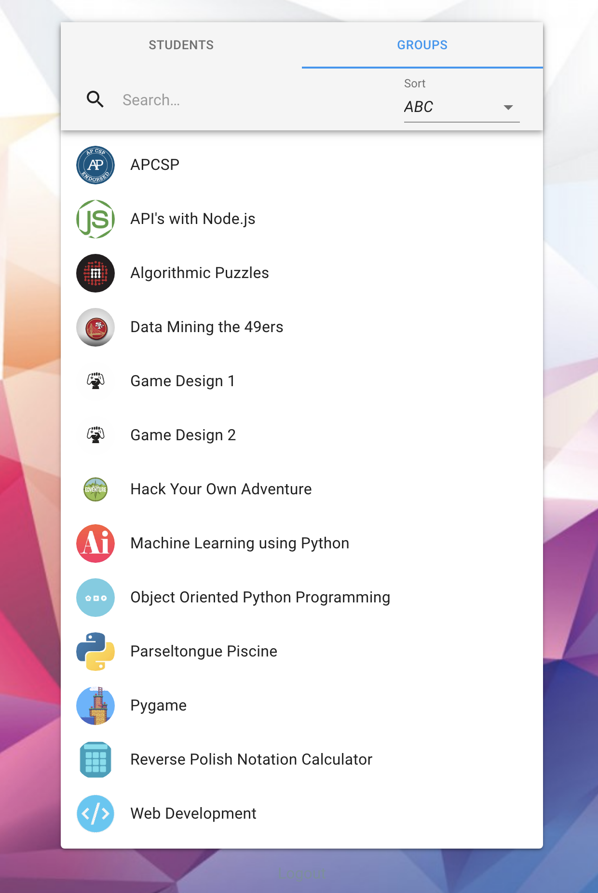
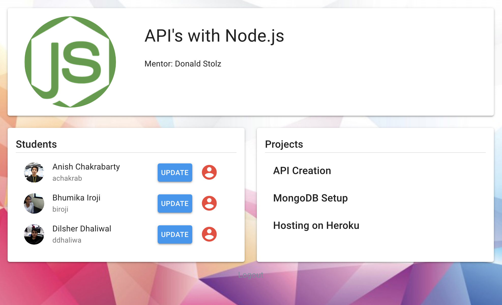

# User Instructions

These instructions will guide you through basic setup and use of the Hack High School Student Management App

## Registration

1. Go to [https://hackhighschool.herokuapp.com/register](https://hackhighschool.herokuapp.com/register)

2. Fill out the basic form
      <!--  -->
   

      
   

## Basic Use

### Sign In

- Once you have registered, you should automatically be logged in.
- If you are not already logged in, attempting to visit any page on the site will automatically redirect you to the sign in page.

### Views

- **Full Student List:** This is part of the site's landing page. This section allows you to easily view, search, and sort all students. Mentors are able to update daily goals and progress, as well as set a student's group. Administrators are also able to update a student's checkin status.

  

  	
  

- **Full Group List:** This is the second on the site's landig page. This section allows you to easily view, search, and sort all groups.

  

  	
  

- **Student Profile:** This page is accessed by clicking on a student's list item. It allows you to easily see the student's _Current Group_, _Current Project_, _Level_, _Attendance History_, _Projects_, _Progress Reports_, & _Badges(tbd)_.

  

  	
  

- **Group Profile:** This page is accessed by clicking on a group's list item. It allows you to see the group's _Current Mentor(s)_, _Current Students_, & _Current Projects_.

  

  	
  

### Actions

- **Add Goal:** Click on the `Update Button` and select _Add Goal_ to track a student's daily goal.

  

  	
  

  

  	
  

- **Add Progress:** Click on the `Update Button` and select _Add Progress_ to complete complete a student's daily progress report.

  

  	
  

- **Set Group:** Click on the `Update Button` and select _Set Group_ to update a student's group.

  

  	
  

  

  	
  

- **Check in/out:** _Administrators Only_ Simply click the `Check In/Out Button` to toggle a student's check in status. Student's can only be checked in and out **once per day**.
  

  	
  

